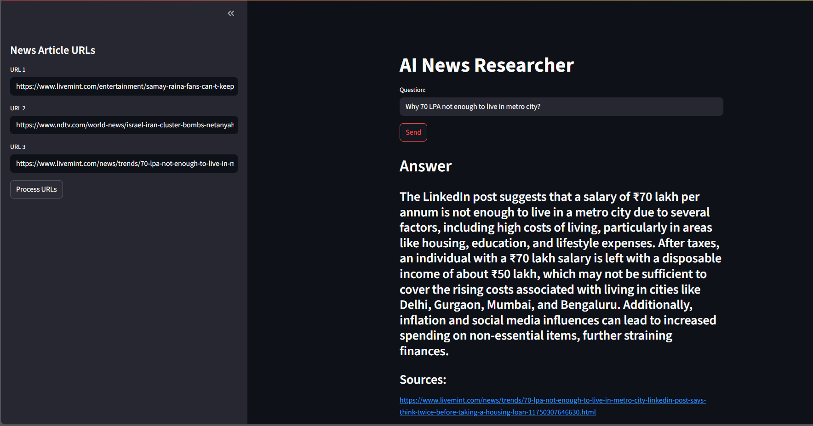

# AI News Researcher

This is a learning project where I have explored and learned various Langchain components such as RetrievalQA, RecursiveCharacterTextSplitter, UnstructuredURLLoader, OpenAIEmbeddings, and FAISS.

AI News Researcher is a Streamlit web application that allows users to input news article URLs, process their content using AI-powered vector embeddings, and ask questions to get insightful answers based on the content of those articles.

## Demo
You can access the live demo of this project hosted on Streamlit Community Cloud at the following URL:

[https://suraj0004-ai-news-researcher-main-fswmsr.streamlit.app/](https://suraj0004-ai-news-researcher-main-fswmsr.streamlit.app/)


## Screenshot



## Features

- Input multiple news article URLs for processing
- Create vector embeddings of article content using OpenAI embeddings and FAISS
- Ask questions about the content and get AI-generated answers
- View sources of the answers for transparency

## Installation

1. Clone the repository:
   ```bash
   git clone <repository-url>
   cd AI-news-researcher
   ```

2. Create and activate a virtual environment (optional but recommended):
   ```bash
   python -m venv venv
   source venv/bin/activate  # On Windows use `venv\Scripts\activate`
   ```

3. Install the required dependencies:
   ```bash
   pip install -r requirements.txt
   ```

4. Set your OpenAI API key as an environment variable:
   ```bash
   export OPENAI_API_KEY="your_openai_api_key"
   ```
   On Windows (cmd):
   ```cmd
   set OPENAI_API_KEY=your_openai_api_key
   ```

## Usage

1. Run the Streamlit app:
   ```bash
   streamlit run main.py
   ```

2. In the sidebar, input up to 3 news article URLs or use the default URLs provided.

3. Click the "Process URLs" button to load and process the articles.

4. Once processing is complete, enter your question in the input box and click "Send" to get an AI-generated answer.

5. View the answer and the sources used to generate it.

## Project Structure

- `main.py`: Streamlit app that provides the user interface and handles user interactions.
- `langchain_helper.py`: Contains functions to load documents from URLs, create vector embeddings, save/load FAISS index, and query the vector store using Langchain and OpenAI.
- `secret.py`: Contains your OpenAI API key (not included in the repository for security).
- `requirements.txt`: Lists all Python dependencies required to run the project.

## Notes

- Make sure you have a valid OpenAI API key to use the embedding and chat models.
- The vector store is saved locally in the `my_local_faiss_index` directory.
- The app uses the GPT-4o-mini model with a temperature of 0.7 for generating answers.

## License

This project is licensed under the MIT License. See the LICENSE file for details.
